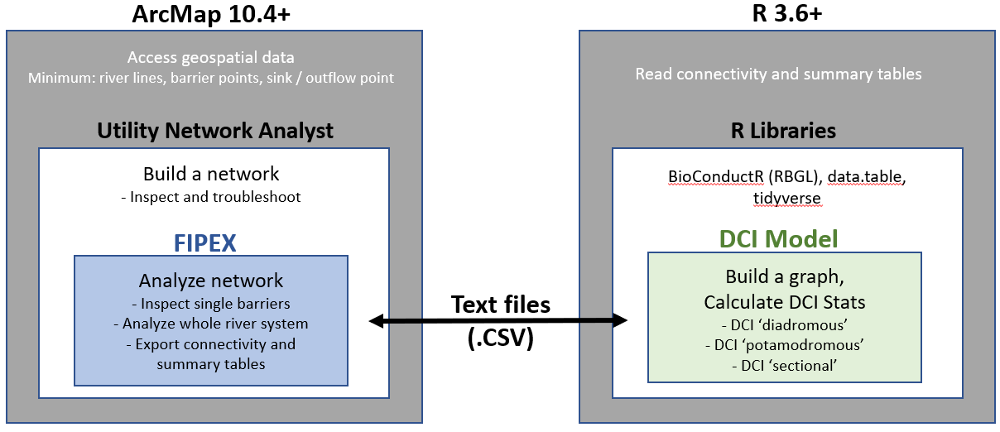
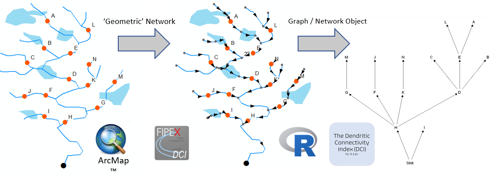
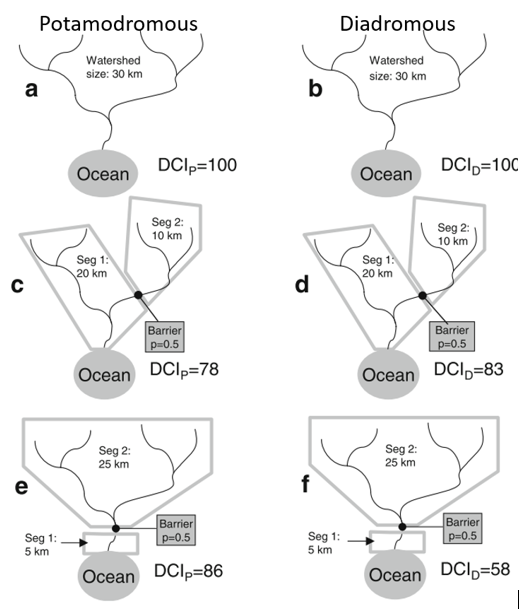

# FIPEX with the DCI 2020 Homepage

## Welcome! 

You've landed on the homepage for the Fish Passage Extension (FIPEX) with Dendritic Connectivity Index (DCI) project. 

The extensive fragmentation of river systems due to damming, road construction, and other development is a problem that many governments, academic institutions, communities, corporations, and environmental groups are trying to solve.  On the path to recovery of _longitudinal_ _connectivity_ (i.e., connectivity from headwaters to ocean / outflow) of river systems many questions arise, including:  

* How fragmented is a river system?
* How much of the fragmentation is due to anthropogenic barriers?
* How much does each barrier contribute to local fragmentation? 
* How much does each barrier contribute to system-wide fragmentation?
* How much habitat or proportion of the river will be restored or reconnected by a given project?
* What kind of habitat will be made available?
* How can limited funds be used most effectively?

River systems present unique challenges when attempting to assess the impacts of barriers and costs/benefits of habitat restoration and connectivity projects, making answering the above questions difficult, time consuming, or both. The Fish Passage Extension (FIPEX) with Dendritic Connectivity Index (DCI) is designed to help address these challenging questions. 

The toolset is designed as an integrated 'Add-in' to the Geographic Information System (GIS) software ArcGIS Desktop™ (ArcMap™ 10.4+) by ESRI™.  It provides basic and advanced tools for assessing river systems with respect to their longitudinal connectivity and can assess individual and cumulative impacts of barriers to fish passage such as dams, weirs, and culverts.  FIPEX can be differentiated from other toolsets for river / watershed network analysis in that it leverages the geometric network model provided with the ESRI ArcGIS Desktop™ suite. 

By using the geometric network model, the direction of flow can be set and network analyses can be conducted without the need for Digital Elevation Models, careful attention to digitization direction, or other datasets; users simply need river lines  and a river outflow point. 

FIPEX is made freely available courtesy of various developers and sponsoring institutions over the years. 

# FIPEX Overview
[back to top](#fipex-with-the-dci-2020-homepage)

The Fish Passage Extension for ArcGIS 10.4 (FIPEX) with the Dendritic Connectivity Index (DCI) is a toolset for assessing the individual and cumulative effects of watercourse obstacles on the connectivity of river systems. FIPEX offers the ability to quantitatively assess the effects of real or anticipated barriers.  

[Gabby's Video]

The following are the main features:   
1.	Summarize river quantity affected by one or many barriers, where habitat affected may be defined as: 

	a)	habitat immediately upstream of a barrier (until the next barrier or headwaters)
	
	b)	habitat immediately downstream of a barrier (until the next barrier or headwaters)
	
	c)	total habitat upstream of a barrier (ignoring all other barriers)
	
	d)	total habitat downstream of a barrier (with the flow of the system, until the ocean / sink)

	e)	total habitat downstream of a barrier (ignoring flow direction)
2.	Allow flexible definition of habitat quantity, allowing users to choose from: 
	
	a)	Length / linear network (e.g., metres)
	
	b)	Polygonal / area network (e.g., hectares) 
	
	c)	Either (a) or (b) while excluding certain features (e.g., stillwater, wetland, lake 'spines')
3.	Classify river and assess quantity by class (e.g., lakes, river, wetland, urban area). 
4.	Exclude certain barriers (e.g., waterfalls) from analyses.
5.	Calculate the Dendritic Connectivity Index (DCI): 
	
	a)	DCId where d stands for ‘diadromous’ connectivity; assessing connectivity from sources to sink. 
	
	b)	DCIp where p stands for ‘potamodromous’ connectivity; assessing connectivity within the system ignoring flow direction (i.e., undirected connectivity)
6.	Assess the ‘sectional’ DCI for each barrier; evaluate the impact of individual barriers on directed connectivity with attention to natural vs artificial barriers.

# Who is the Typical User of FIPEX?
[back to top](#fipex-with-the-dci-2020-homepage)

Ultimately, the goal of FIPEX is to provide the everyday user with a decision support tool for fish passage and riverine connectivity assessment.  Setup of FIPEX 10.4 is best done by an intermediate to advanced user of ArcGIS™ - typically a GIS technician or GIS specialist. Familiarity with the geometric network model (usage of the Utility Network Analyst toolbar) is an asset. 

After a river network is created, barriers are organized and labelled, quality assurance on the data is done, FIPEX is installed, options are set, and preliminary tests are done, FIPEX can be used as a decision support tool by people without GIS skills. The flexibility offered by the toolset and advanced options such as coupling with the statistical software, 'R', mean that the typical user should have experience with ArcGIS and technical knowledge of windows-based software and operating systems.  

# The Dendritic Connectivity Index (DCI)
[back to top](#fipex-with-the-dci-2020-homepage)

The Dendritic Connectivity Index (DCI) is a measure of longitudinal connectivity of a river system (Cote et al., 2009). 

Cote, D., Kehler, D. G., Bourne, C., & Wiersma, Y. F. (2009). A new measure of longitudinal connectivity for stream networks. Landscape Ecology, 24(1), 101-113.

The framework calculates the expected connectivity of a river system given the barriers present, barrier passability, barrier type, habitat quantity and river length. The DCI comes in several ‘flavours’: 
* __DCI__ __diadromous__ __(DCId)__: connectivity to / from the sink or outflow
* __DCI__ __potamodromous__ __(DCIp)__: connectivity to / from every river segment to every other river segment
* __DCI__ __sectional__ __(DCIs)__: connectivity to / from a given segment
* __DCI__ __(natural-only)__: connectivity considering only natural barriers
* __DCI__ __with__ __distance__ __decay__: connectivity considering maximum distance threshold or distance decay function (can be applied to any of the DCI ‘flavours’ above)

# Installation
[back to top](#fipex-with-the-dci-2020-homepage)

## License
Prior to installation please read and accept the [disclaimer and license](https://github.com/goldford/FIPEX_with_DCI_Website/blob/master/LICENSE).  The FIPEX toolset is provided as is, where is.

When redistributing this software, leveraging it, or presenting results based on the usage of this software we request that you adhere to the terms of license and provide attribution. 

## Software Requirements
* Windows 10 Operating System (earlier versions of Windows may work but are untested)
* ArcGIS 10.4+ Desktop™ Installed (Standard level license or above preferred for network editing tools)
* The Microsoft .NET framework 4.5+ installed (usually installed automatically with ArcMap)

## Hardware Requirements
* A PC Computer with 4Gb+ RAM 
* 2.4Gb+ disk space (requirement for operation of ArcGIS™ Desktop)
* CPU Speed 2.2Ghz+

## Prerequisites
Prior to installation, ensure that the following requirements are met: 
* ESRI™ ArcGIS™ 10.4+ is installed
* ArcMap™, ArcCatalog™ and all other ArcGIS™ products are not running. 
* You have Administrator level privileges on your computer (not required but preferred).

More to come...

# Acknowledgements

Thanks to: 
David Cote
Christopher Edge
Phil Greyson
Eldon Gunn
Gabrielle Riefesel
Sebastian Harder
Dan Kehler
David Longard
Koreen Millard
Peter Duinker
Ken Meade
Peter Rodger
Donald Sam 
Yolanda Wiersma

Dalhousie University
Fisheries & Oceans Canada
Memorial University
Parks Canada
Natural Sciences & Engineering Research Council of Canada
Nova Scotia Power Inc.

Additional development sponsored by
Fisheries & Oceans Canada - 2020 upgrade to 10.4+ 
Parks Canada - DCI Integration and Upgrade from FIPEX version 2.3.x (for ArcGIS) 9.x to FiPEX 
Parks Canada - version 10.23 for (ArcGIS 10.23, 10.3)

FIPEX 1.0 (the "American Eel Decision Support Tool") created in 2008 by
Fisheries and Oceans Canada, Habitat Management, Maritimes Region 

Documentation created and updated by:
Greig Oldford 